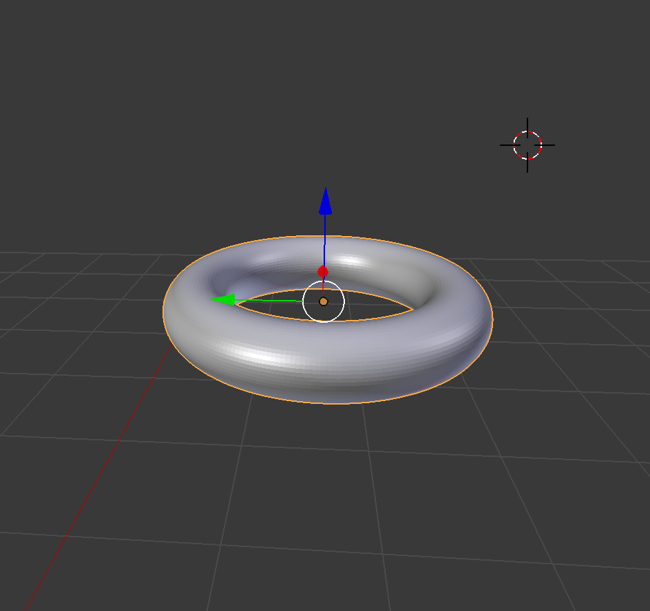

Advanced Computer Graphics - Ray Tracing Rendering Engine
======================================

# Info

This is a ray tracing rendering engine entirely made in C++.
This engine is based on the properties of light and aims at replicating what happens in real life to render images.
By Nicolas Buisson, using Nori, the educational ray tracer. See Nori at https://github.com/wjakob/nori.

# Project renders and functionnalities

## Textures
===========================

### Theory
------------------------------

The implementation of textures is a very basic feature in rendering engines, may it be for gaming engines or ray tracing engines. The idea is to map a texture map (2D image) to the surface of a 3D object. Usually this uses UV coordinates, which are defined for every vertex of the 3D object. Then an interpolation takes place on the polygon to have access to the exact point of color on the 2D image.

Texture:  

### Implementation
------------------------------

Textures have been implemented directly in the BSDFs classes. The easiest implementation is the diffuse one: I added a file string to the xml class which specifies which texture file should be used. The BSDF class loads the texture as a bitmap object, and then instead of retrieving the albedo parameter of the class (which defines the color), it has access to the UV coordinate on the texture image. This is easy to do since the intersection class already computes the corresponding UV coordinate (so it's just another parameter to pass to the class in the intersection record).

### Problems solved
----------

There was a main issue using the nori exporter for blender with UV coordinates: in the wavefront obj format, faces are defined as 3 or 4 triplets of vertex/UV/normal. However, a vertex in blender can have multiple UV coordinates: it depends on which face the vertex is linked to. The nori exporter did not account for this and therefore the texture was always off, so the solution was to change the python script nori exporter to account for this (basically before my texture were just repeated over all triangles quite randomly, but now it's working just fine).

Following we've got the result with a basic bright diffuse brick texture.

Textured diffuse wall:  

## Normal Maps
===========================

### Theory
------------------------------

Normal maps are also a very common feature of rendering engines. They allow to have more details while keeping a low poly count. For this, we also use UVs and 2D textures, but this time they don't define a color, but the normal of the surface at this point.

Normal map:  

### Implementation
------------------------------

For the implementation, this time the normal map is added to the mesh directly and not its material, as the mesh class contains the normals of the 3D object. So the idea is whenever we look for an intersection, if the mesh has a normal map, instead of computing the normal based on the vertices of the surface, we use the computed UV coordinates and query the mesh (which than queries its normal bitmap) for the corresponding normal direction.

This leads to much more details, and with a single polygon (a square with 4 vertices), we get the upgrade in the followwing image.

With vs without normal mapping:  
  

## Camera lens for depth of field
==================================================

### Theory
----------

Usual 3D rendering engines have no real camera effects: everything is in focus. But in the real world, it's impossible to have a render with all planes in focus due to lens effects (may it be in cameras or with our bare biological eyes). So the idea was to implement a simple lens effect to our camera model, with focal length and lens radius as paramaters.

The focal length determines the distance of the focus (so usually, what we will do is set it so that the main object of the scene is in focus, bringing the attention of the viewer to this part of the scene), while the lens radius will affect the amount of blur on the other planes. Note that an infinitely small lens leads to an image with all planes in focus.

### Implementation
----------

The implementation was rather simple: in the camera model, I added two parameters that can be set in the xml file (focal distance and lens radius), and then whenever we query a new ray, I implemented the distorsion due to the lens effect: we sample a random uniform point on the camera lens and then cast the ray to the plane of focus.

Therefore, there is some noise introduced by this camera effect: the larger the lens is, the more noise we introduce (due to the random sampling on the entire lens). Here are two images with the same focal distance but different lens radius (one small and one large).

Small lens (0.1) vs large lens (0.8) for the same focal distance:  
  

## Preloaded BRDFs
===================================

### Theory
----------

I wanted to add a way to load precomputed BRDFs based on data collected on real materials. The idea is to have binary files containing the BRDF values (so it depends on the incoming and outgoing directions) for a material. The Mitsubishi Electronics Research Lab has a collection of such binary files, with a C++ loader comming along side to have access to the data.

### Implementation
----------

So I implemented a new BSDF for loading these particular BRDFs. I implemented the C++ loader in the BSDF class (so there's a parameter in the xml file to specify which binary file to use), and then when evaluating the BRDF using an ingoing and outgoing ray, we look in the binary file for these parameters and interpolate the final BRDF value.

When sampling and evaluating the pdf for this BSDF, we use the same sampler as for the diffuse BSDF (cosine weighted hemisphere). I wanted to implement a more complex sampler, based on the BRDF data, but did not have enough time to look into it. As a consequence, BRDFs which are similar to diffuse ones will be less noisy.

In the following images are binary files loaded and used as materials.

Cornell box with a gold BRDF:  
  

Cornell box with a yellow plastic BRDF:  
  

Dragon miniature with a brass BRDF:  
  

Dragon miniature with a steel BRDF:  
  

Dragon miniature with a gold paint BRDF:  
  

Dragon miniature with a blue acrylic BRDF:  
  

## Custom meshes
=========================================================

For the final render, I needed some custom meshes for a light, a light stand, a table, few diamonds, and a wall-e mesh.

Light stand (custon mesh):  
  

Light bulb (custom mesh):  
  

Table (custom mesh):  
  

Diamonds (custom mesh):  
  

Wall-e (I used a tutorial to create it, the animation pose is custom):  
  

## Homogeneous medium (volume rendering)
=========================================================

### Theory
----------

Volume rendering lets us render complex types of volume. In my implementation, I decided to go for only homogeneous volumes (so with constant absorption and scattering values). The main idea is that when a ray enters a volume, there's always a probability to encounter a particule within this volume after a certain distance, which will randomly scatter the ray in a new direction. If we get out of the volume, we create a new ray in the old direction.

Therefore, our algorithm needs to sample a distance randomly and check if we are still in the volume (if we are not or encounter a surface, we use the normal algorithm to compute the radiance). If this is the case, we query a new ray in a new random direction.

### Implementation
----------

First, I needed to implement volumes for meshes. I decided to set the volume parameters directly in the mesh class, as when intersecting the mesh, we have to figure out right away whether or not we enter a volume. Furthermore, this lets us define a BSDF for the surface (if we want to have a volume in a specular casing for example, like glass). So we can also define an absorption and a scattering parameter, as I'll use them in the algorithm.

Now for the algorithm part: if we are not in a volume currently, after looking for an intersection, if the intersected mesh is a volume, we sample a length (called t) such that t = -log(1 - epsilon) / mu_t where epsilon is the random sample in [0, 1] and mu t is the extinction coefficient, ie mu_t = absorption + scattering.

If this distance is smaller than the distance at which the next surface is, we sample a new direction from this point (using the uniform sphere sampler), and we simply modify the multiplier by absorption / mu_t (this is a variable of my multiple importance sampler which directly affects the ray's radiance for the next ray query).

However, if we find a surface before, we just sample a new ray using its BRDF sampler, and adjust the ray's radiance accordingly. Finally, if we get out of the volume, we query a new ray in the previous direction.

I did not manage to correctly implement a more sofisticated sampling model, as when there's a scattering event, we could compute the probability for the next ray to directly reach a light source and therefore have a multiple importance sampler inside the volume, so I stayed with the normal algorithm. Below we can find the dragon model with different mediums: with absorption, scattering and a glass casing or not.

Volume inside a glass miniature (scattering vs absorption):  
  
  

Volume without surface (scattering vs absorption):  
  
  

## Final render
=========================================================

With all of these features implemented, this is the final image I rendered. I used textures and normal maps for the table and the grass, custom BRDFs for wall-e, the pot and the light's stand, a lens effect to focus on the main subject (the plant) and finally I wanted to use the homogeneous volume to render the plant, but could not manage to have a good render of it (I think my geometry and the amount of different volumes for the grass had it go wrong), so I had to go and use a texture with a diffuse surface, which up looking all right for grass as the light above it is very bright.

Final render:  

